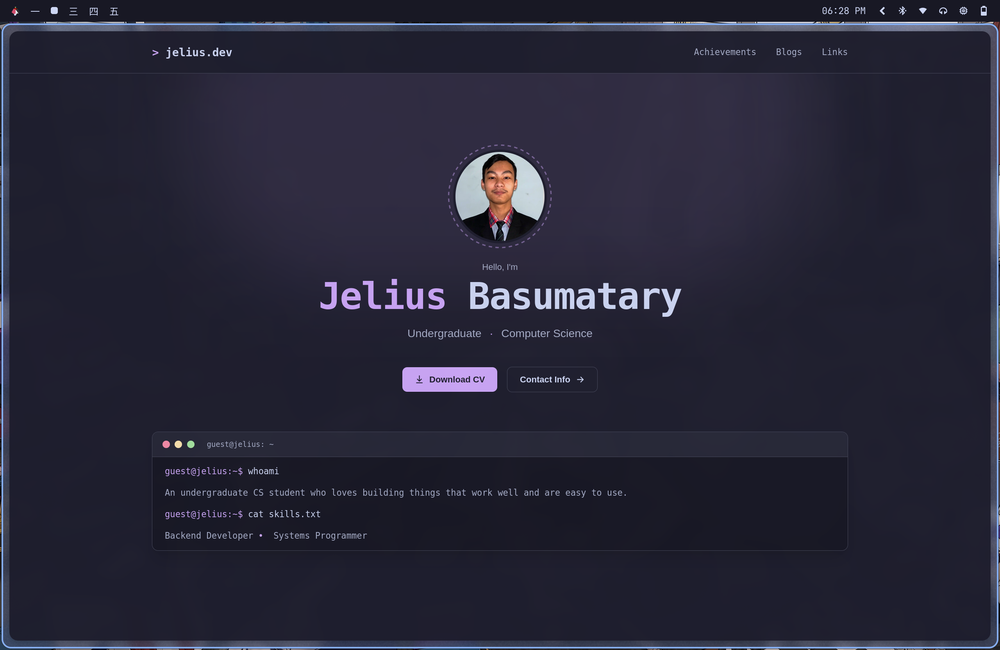

# jelius.dev

> Personal portfolio & links site — server-rendered Go backend with a terminal-inspired UI.

**Live:** [jelius.dev](https://jelius.dev) · [jelius.dev/links](https://jelius.dev/links)



---

## Tech Stack

**Backend**
- Go — Primary Programming Language
- [templ](https://templ.guide) — For typed HTML templating
- SQLite — Primary Datastore (raw SQL, no ORM)

**DevOps / Infra**
- VPS-hosted, reverse-proxied with Caddy
- Cloudflare in front of the main site (orange-cloud proxy)
- `cdn.jelius.dev` — static assets served via CloudFront, origin pointed at the same VPS
- Cache-control tuned to avoid HTMX partial/full-page response collisions (moving toward a short-lived in-process render cache keyed on relevant HTMX headers)
- `air` for hot-reload dev workflow; `Makefile` for build/prod tasks

## Features

- **Database-backed content** — home page, links page, and blog metadata are all driven by SQLite tables
- **SEO/metadata system** — route-keyed `metadata` / `m_links` / `m_meta` tables, with wildcard (`*`) entries for shared tags and per-route overrides
- **Blog engine** — server-rendered post list with HTMX infinite scroll, and a series system (prequel/sequel chaining) resolved via a cycle-safe recursive CTE + pointer-stitching in Go

## Project Structure

```
.
├── api
├── assets
├── build
├── cache
├── cmd
├── db
├── go.mod
├── go.sum
├── legacy
├── LICENSE
├── Makefile
├── middleware
├── README.md
├── renderer
├── template
├── tmp
└── types
```

## Development

```bash
git clone https://git.jelius.dev/jelius-sama/Portfolio.git
cd Portfolio
cd legacy/markdown && bun install && cd ../..

air          # dev mode
make build   # prod build
```

## License

[AGPL 3.0 or later](./LICENSE)
